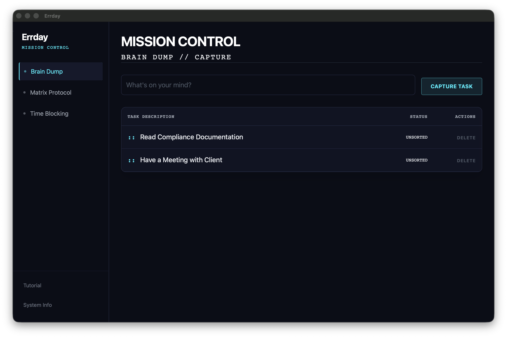
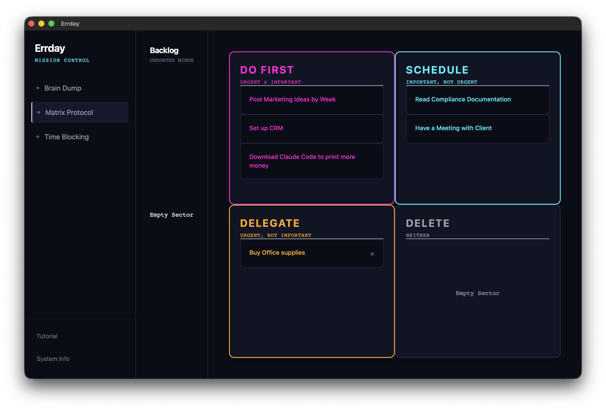
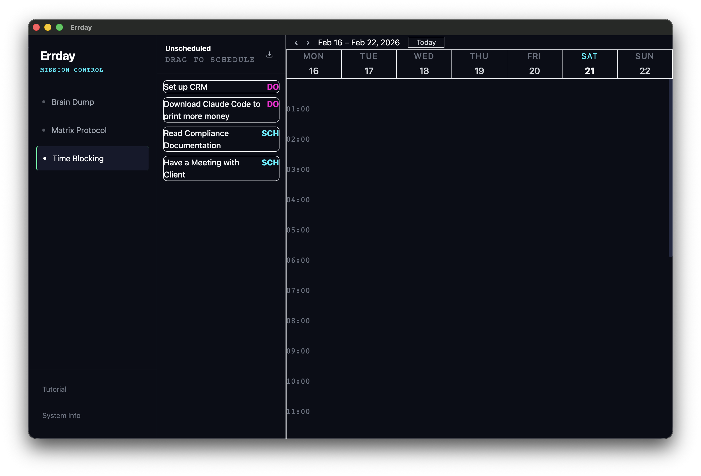
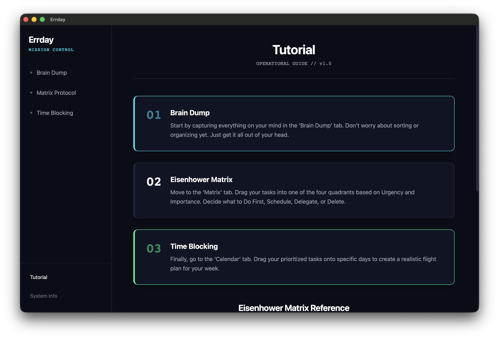

# Errday
A standalone desktop app built to visualise priority tasks for startup founders using the Eisenhower Matrix method.

# Overview
As a startup founder, I get slammed with tasks to do everday. Theres so many different methods to manage your time. Pomodorro, Calendar, traditional TODOs list, etc. And, theres not a lot of clear webapps that can organize my thoughts in building a business. That is, without charging you or limiting core features, forcing people to sign up. 

I want to go back to the good old days of using single-use apps that don't require cloud hosting. Hosting on the cloud is great and has many benefits. But not for what I need. 

# System Requirements
| Platform | Min. OS Version | Architecture | Approx. Storage | Additional Dependencies |
| :--- | :--- | :--- | :--- | :--- |
| **macOS** | 10.15 (Catalina) or later | Apple Silicon (M1+) or Intel x86_64 | ~5 MB | None |
| **Linux (Mint / .deb)** | Linux Mint 20+ / Ubuntu 20.04+ | x86_64 / ARM64 | ~5 MB | `libwebkit2gtk-4.0-37` |
| **Windows** | *Coming Soon* | *Coming Soon* | *Coming Soon* | *Coming Soon* |

# Design
## Brain Dump

## Eisenhower Matrix

## Calendar

## Tutorial


## System Info


# Documentation
To learn more, please find the rest of the documentation in the docs folder. The following figure shows the folder structure of what to expect.
```
docs/
    |
    |- about.md
    L <INSERT NAME>.md
```

# How will I make this app?
I will be using Dioxus, a Rust framework for creating cross-platform apps. Rust is a systems programming language. It combines the performance of C and C++ while being memory safe and type safe. It's a game changer for writing robust code. Rust also has an amazing compiler which shows detailed logs that mean something. And it teaches you, your errors and how to fix them. Something C ad C++ doesn't have unless you install libraries.
## Tech stack
Heres a list of everything expected to be used in this application. 
- Rust
- Dioxus
```
project/
├─ assets/ # Any assets that are used by the app should be placed here
├─ src/
│  ├─ main.rs # main.rs is the entry point to your application and currently contains all components for the app
├─ Cargo.toml # The Cargo.toml file defines the dependencies and feature flags for your project
```

# Credits
@ 2026 Mutabie Canada Inc
Website: [Mutabie Canada Inc](https://mutabie.ca)
Email: [info@mutabie.ca](mailto:info@mutabie.ca)